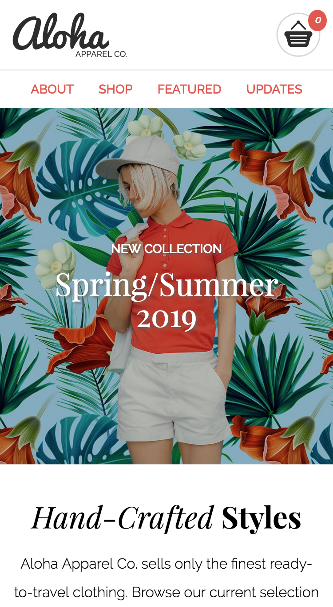
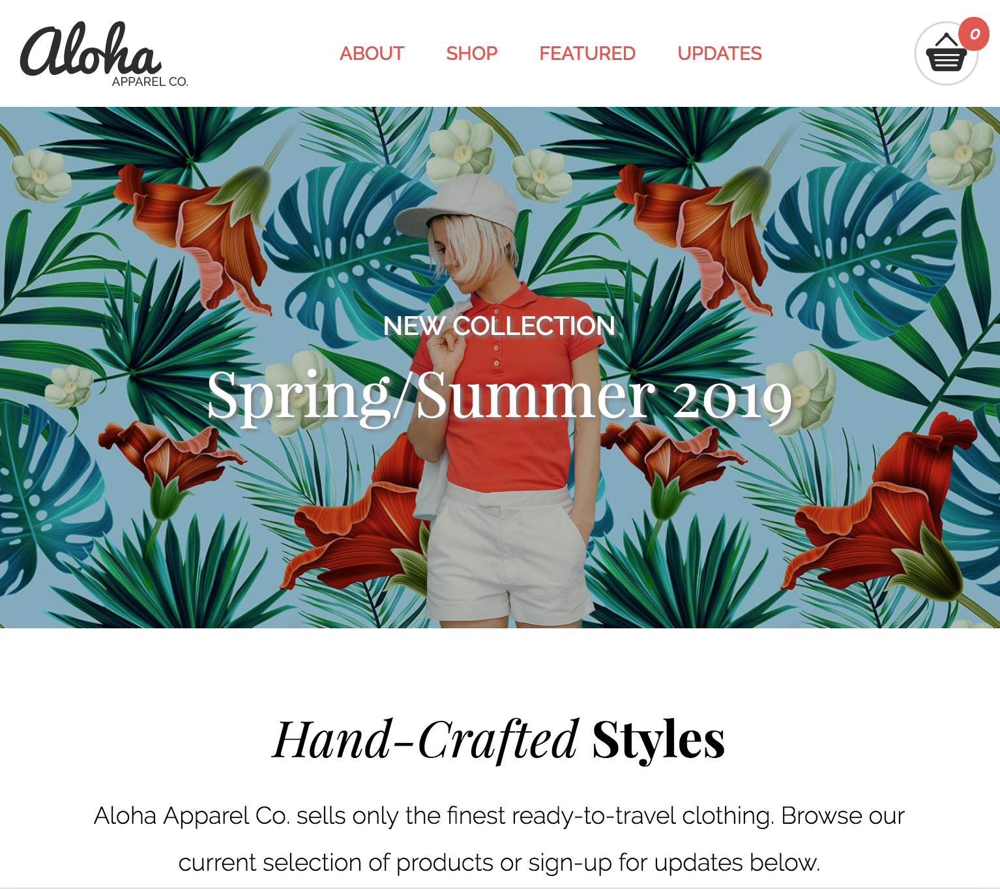
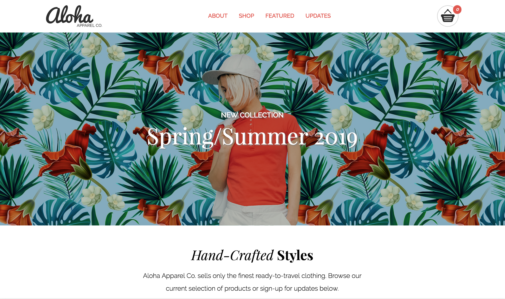

# Project 1: Aloha Apparel Co.

This project focuses on learning HTML, CSS, JavaScript and jQuery by remaking the "Aloha Apparel Co." website, originally created by RED Academy.

## **Responsive Design**

Mobile-first, responsive design. Breakpoints at `600px` for tablet and `1240px` for desktop.

**Mobile**:

**Tablet**: breakpoint at `600px`:

**Desktop**: breakpoint at `1240px`:

## **Technologies**

- **Styling:** flickity, fontawesome, transfonter
- **Built With:** Visual Studio Code

## **Personal Learnings**

- Using HTML to create the backbone of a website
- Using CSS to style the website, such as fonts, colors, sizing, flexbox, text-decoration
- Using JavaScript/jQuery to add behaviour to the website
- Organizing code in a clean and orderly manner

## **License**

Learning materials content is copyright (c) 2019 RED Academy.
